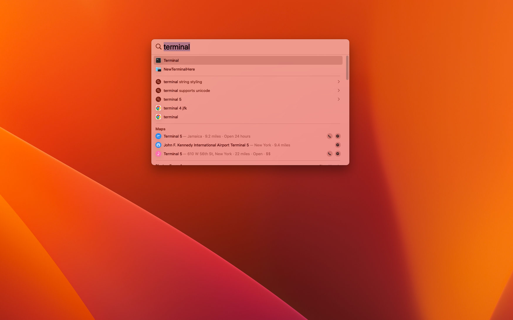
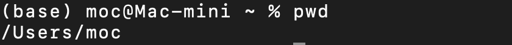
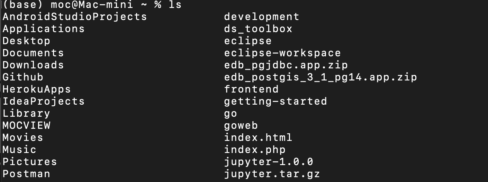
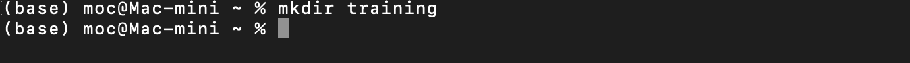
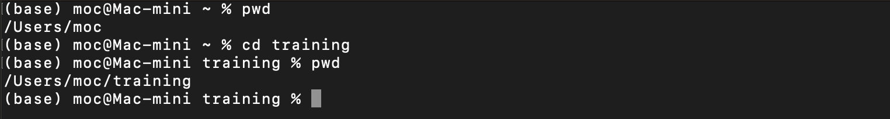
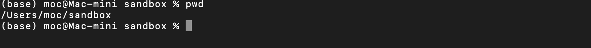
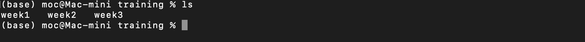
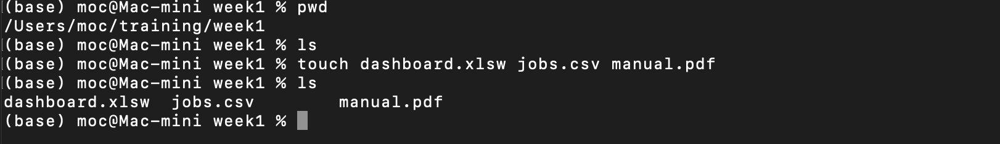

# Terminal Commands 
The following provides a basic introduction into the world of Terminal (on Windows) and the Terminal Emulator on Mac OS, both of which provide text-based command line interaction with the respective operating system. This is designed to introduce users to the core commands needed to navigate files and directories as well as communicate and execute commands against the operating systems.
## Launching the Command Terminal.
The Terminal program can be launched graphically or with a text-based command both on Windows and Mac.

### Graphically on Windows

### Via the run command 

### Graphically on Mac
From your Mac Desktop, click the spotlight icon among the list of icons displayedin the top right corner. Type the word terminal as shown below and press Enter key.



### Present working directory (pwd)
When working in a terminal environment, it is important to have awareness of where you are executing commands from. Just like a house or a building, you need to know where you are starting from to be able to navigate to the room, floor or section of the house or building that you need to get to. Use the following command to determine your current location:
``` zsh
    pwd
```



### List files and directories in the current working directory (ls)
``` zsh
    ls
```


### Make a Directory (i.e. folder) in the current working directory (mkdir)
On Unix-like terminals (Mac, Linux) and modern versions of Windows we have the ability to create a new folder using the **mkdir** command. While legacy versions of Windows operating systems used **md** to make a directory, I think it is pretty safe to use the mkdir command in terminal environments for all of the above OS's.  

``` zsh
    mkdir {name_of_directy}
```



### Change directory to the newly created trainig directory (cd)
Once a directory has been created, a user has the option to switch to that directory to view its contents or add additional files or folders to the directory.



## Understanding Absolute (/) and Relative (./) Paths
Terminal offers great flexibility and timesaving features by allow users to give commands using absolute and relative paths. Absolute path requires an explicit reference beginning from the root folder (/) unless the current working directory is a part of the fully qualified path. While relative path requires a  reference to the target folder which is relative to the present working directory. For example, let's say our present working directory is **/Users/moc/sandbox** and we would like to create 3 directories (week1, week2, week3) in the **/Users/moc/training** folder. This is how we could achieve this using Absolute and Relative Paths.

### First confirm our current location


### Using Absolute path
``` zsh
    mkdir /Users/moc/training/week1 /Users/moc/training/week2 /Users/moc/training/week3
```



### Using Relative path
``` zsh
    mkdir ../training/week1 ../training/week2 ../training/week3
```


### Creating Files 
The real benefit of creating folders is to allow us to organize and contain additional folders (i.e. sub-folders) and files. We already know the command to create a folder and creating a file is just as simple.

``` zsh
    touch {name_of_file_including_extension}
```



