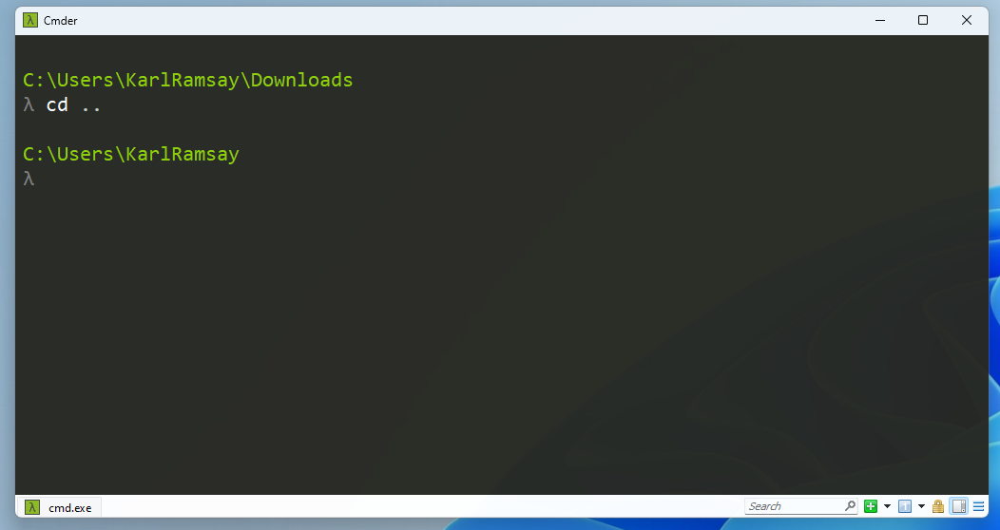

# Navigating Nested Folders in Terminal 
Once you master the basic commands of terminal, the remaining challenege is traversing the tree-like hierarchy of the storage volume. This is faciliated by using absolute and relative paths.

## Absolute Paths
Absolute path requires an explicit reference to a directory or file using a fully qualified path inclusive of the root of the file.

BENEFIT: The path to teh directory or file being references is fully qualified and avoids th

## Relative Paths
Relative path requires a reference to a directory or file based on the current location from which the command is being made.

## Special Folder reference  (Relative Paths)
To navigate to a l
``` zsh
    cd ..
```

``` zsh
    cd ../..
```

see example below


## When to Use Absolute vs. Relative

